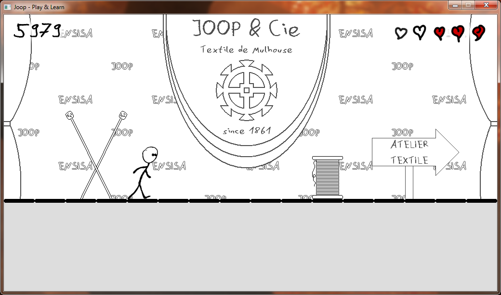

Joop
====

Projet de 1ère année de l'ENSISA

Réalisé par :
* [Simon Chevalier](https://github.com/astazou)
* [Laetitia Gaignier](https://github.com/Laetitia28)
* [Florent Lacroix](https://github.com/Dahwar)
* Thibaud Renaux
* [Karl Woditsch](https://github.com/Rauks)

Pour plus d'informations : http://joop.kirauks.net

Impressions d'écrans
====================

